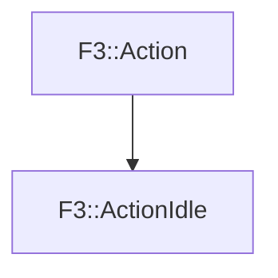

# F3::ActionIdle

[Return to `F3`](/docs/F3.md)

## C++

- [`ActionIdle.hpp`](/c++/include/ActionIdle.hpp)
- [`ActionIdle.cpp`](/c++/source/ActionIdle.cpp)

## References

- [`F3::Action`](/docs/F3/Action.md)

## Inheritance

[Return to `F3`](/docs/F3.md)