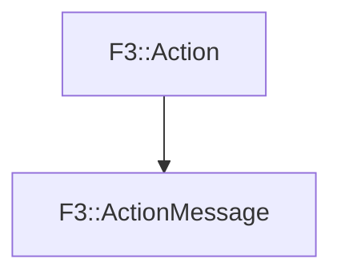

# F3::ActionMessage

[Return to `F3`](/docs/F3.md)

## C++

- [`ActionMessage.hpp`](/c++/include/ActionMessage.hpp)
- [`ActionMessage.cpp`](/c++/source/ActionMessage.cpp)

## References

- [`F3::Action`](/docs/F3/Action.md)

## Inheritance

[Return to `F3`](/docs/F3.md)