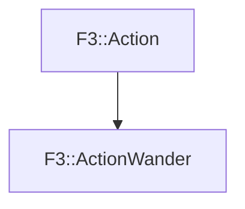

# F3::ActionWander

[Return to `F3`](/docs/F3.md)

## C++

- [`ActionWander.hpp`](/c++/include/ActionWander.hpp)
- [`ActionWander.cpp`](/c++/source/ActionWander.cpp)

## References

- [`F3::Action`](/docs/F3/Action.md)

## Inheritance

[Return to `F3`](/docs/F3.md)