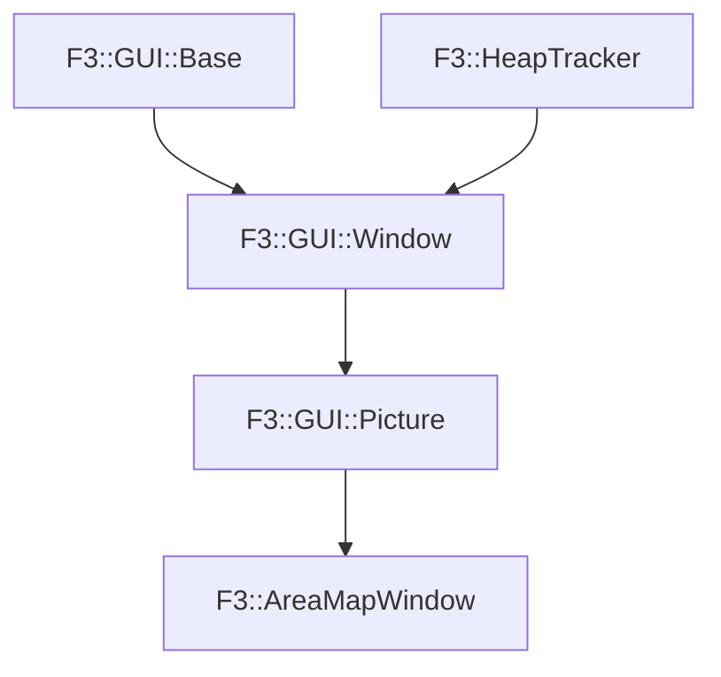

# F3::AreaMapWindow

[Return to `F3`](/docs/F3.md)

## C++

- [`AreaMapWindow.hpp`](/c++/include/AreaMapWindow.hpp)
- [`AreaMapWindow.cpp`](/c++/source/AreaMapWindow.cpp)

## References

- [`F3::GUI::Base`](/docs/F3/GUI/Base.md)
- [`F3::HeapTracker`](/docs/F3/HeapTracker.md)
- [`F3::GUI::Window`](/docs/F3/GUI/Window.md)
- [`F3::GUI::Picture`](/docs/F3/GUI/Picture.md)

## Inheritance

[Return to `F3`](/docs/F3.md)