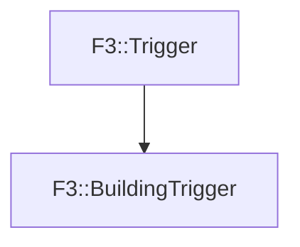

# F3::BuildingTrigger

[Return to `F3`](/docs/F3.md)

## C++

- [`BuildingTrigger.hpp`](/c++/include/BuildingTrigger.hpp)
- [`BuildingTrigger.cpp`](/c++/source/BuildingTrigger.cpp)

## References

- [`F3::Trigger`](/docs/F3/Trigger.md)

## Inheritance

[Return to `F3`](/docs/F3.md)