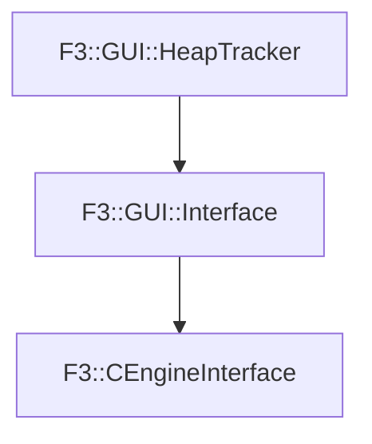

# F3::CEngineInterface

[Return to `F3`](/docs/F3.md)

## C++

- [`CEngineInterface.hpp`](/c++/include/CEngineInterface.hpp)
- [`CEngineInterface.cpp`](/c++/source/CEngineInterface.cpp)

## References

- [`F3::GUI::HeapTracker`](/docs/F3/GUI/HeapTracker.md)
- [`F3::GUI::Interface`](/docs/F3/GUI/Interface.md)

## Inheritance

[Return to `F3`](/docs/F3.md)