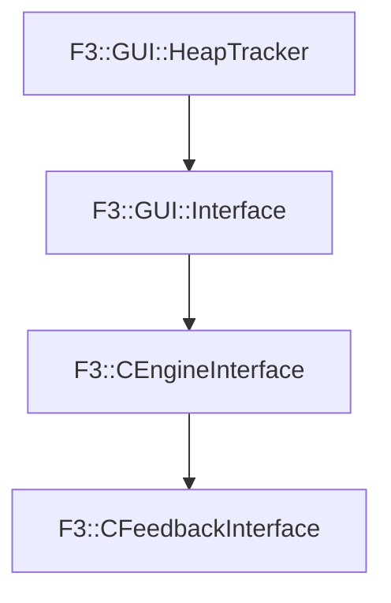

# F3::CFeedbackInterface

[Return to `F3`](/docs/F3.md)

## C++

- [`CFeedbackInterface.hpp`](/c++/include/CFeedbackInterface.hpp)
- [`CFeedbackInterface.cpp`](/c++/source/CFeedbackInterface.cpp)

## References

- [`F3::GUI::HeapTracker`](/docs/F3/GUI/HeapTracker.md)
- [`F3::GUI::Interface`](/docs/F3/GUI/Interface.md)
- [`F3::CEngineInterface`](/docs/F3/CEngineInterface.md)

## Inheritance

[Return to `F3`](/docs/F3.md)