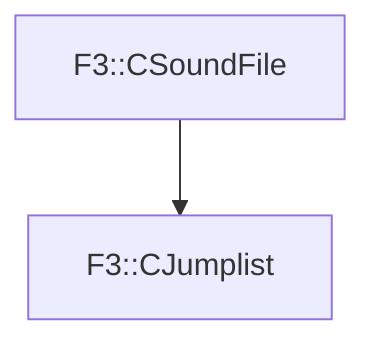

# F3::CJumplist

[Return to `F3`](/docs/F3.md)

## C++

- [`CJumplist.hpp`](/c++/include/CJumplist.hpp)
- [`CJumplist.cpp`](/c++/source/CJumplist.cpp)

## References

- [`F3::CSoundFile`](/docs/F3/CSoundFile.md)

## Inheritance

[Return to `F3`](/docs/F3.md)