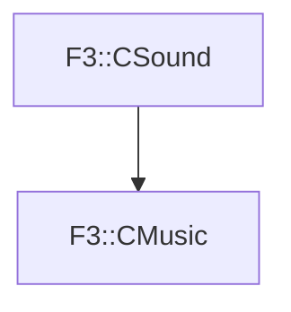

# F3::CMusic

[Return to `F3`](/docs/F3.md)

## C++

- [`CMusic.hpp`](/c++/include/CMusic.hpp)
- [`CMusic.cpp`](/c++/source/CMusic.cpp)

## References

- [`F3::CSound`](/docs/F3/CSound.md)

## Inheritance

[Return to `F3`](/docs/F3.md)