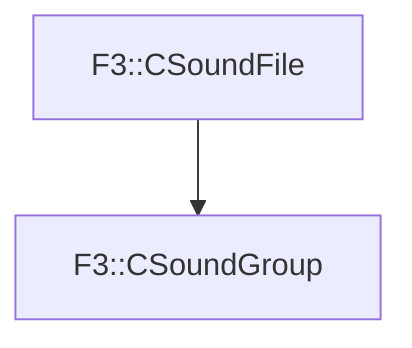

# F3::CSoundGroup

[Return to `F3`](/docs/F3.md)

## C++

- [`CSoundGroup.hpp`](/c++/include/CSoundGroup.hpp)
- [`CSoundGroup.cpp`](/c++/source/CSoundGroup.cpp)

## References

- [`F3::CSoundFile`](/docs/F3/CSoundFile.md)

## Inheritance

[Return to `F3`](/docs/F3.md)