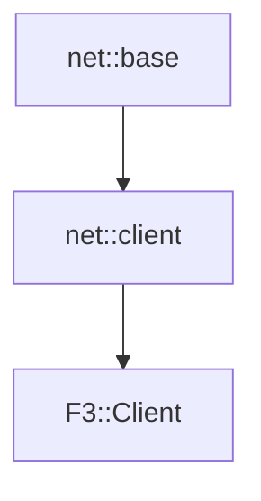

# F3::Client

[Return to `F3`](/docs/F3.md)

## C++

- [`Client.hpp`](/c++/include/Client.hpp)
- [`Client.cpp`](/c++/source/Client.cpp)

## References

- [`net::base`](/docs/net/base.md)
- [`net::client`](/docs/net/client.md)

## Inheritance

[Return to `F3`](/docs/F3.md)