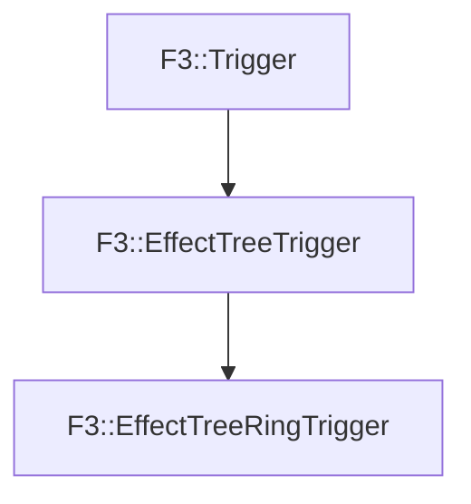

# F3::EffectTreeRingTrigger

[Return to `F3`](/docs/F3.md)

## C++

- [`EffectTreeRingTrigger.hpp`](/c++/include/EffectTreeRingTrigger.hpp)
- [`EffectTreeRingTrigger.cpp`](/c++/source/EffectTreeRingTrigger.cpp)

## References

- [`F3::Trigger`](/docs/F3/Trigger.md)
- [`F3::EffectTreeTrigger`](/docs/F3/EffectTreeTrigger.md)

## Inheritance

[Return to `F3`](/docs/F3.md)