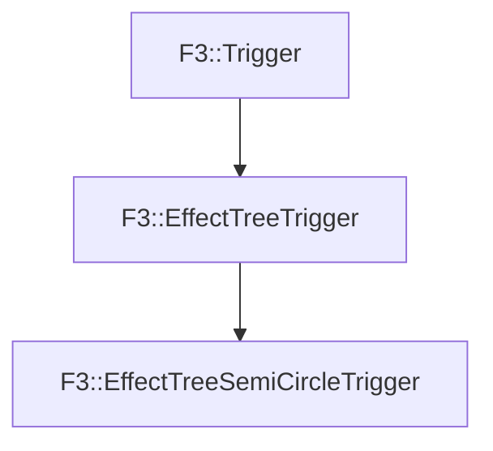

# F3::EffectTreeSemiCircleTrigger

[Return to `F3`](/docs/F3.md)

## C++

- [`EffectTreeSemiCircleTrigger.hpp`](/c++/include/EffectTreeSemiCircleTrigger.hpp)
- [`EffectTreeSemiCircleTrigger.cpp`](/c++/source/EffectTreeSemiCircleTrigger.cpp)

## References

- [`F3::Trigger`](/docs/F3/Trigger.md)
- [`F3::EffectTreeTrigger`](/docs/F3/EffectTreeTrigger.md)

## Inheritance

[Return to `F3`](/docs/F3.md)