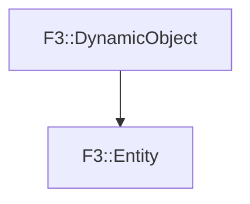

# F3::Entity

[Return to `F3`](/docs/F3.md)

## C++

- [`Entity.hpp`](/c++/include/Entity.hpp)
- [`Entity.cpp`](/c++/source/Entity.cpp)

## References

- [`F3::DynamicObject`](/docs/F3/DynamicObject.md)

## Inheritance

[Return to `F3`](/docs/F3.md)