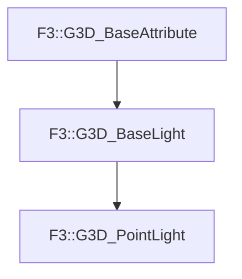

# F3::G3D_PointLight

[Return to `F3`](/docs/F3.md)

## C++

- [`G3D_PointLight.hpp`](/c++/include/G3D_PointLight.hpp)
- [`G3D_PointLight.cpp`](/c++/source/G3D_PointLight.cpp)

## References

- [`F3::G3D_BaseAttribute`](/docs/F3/G3D_BaseAttribute.md)
- [`F3::G3D_BaseLight`](/docs/F3/G3D_BaseLight.md)

## Inheritance

[Return to `F3`](/docs/F3.md)