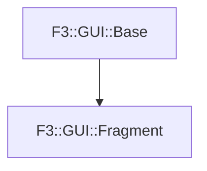

# F3::GUI::Fragment

[Return to `F3`](/docs/F3.md)

## C++

- [`Fragment.hpp`](/c++/include/Fragment.hpp)
- [`Fragment.cpp`](/c++/source/Fragment.cpp)

## Inheritance

```mermaid
graph TD;
    F3::GUI::Base-->F3::GUI::Fragment
```

[Return to `F3`](/docs/F3.md)