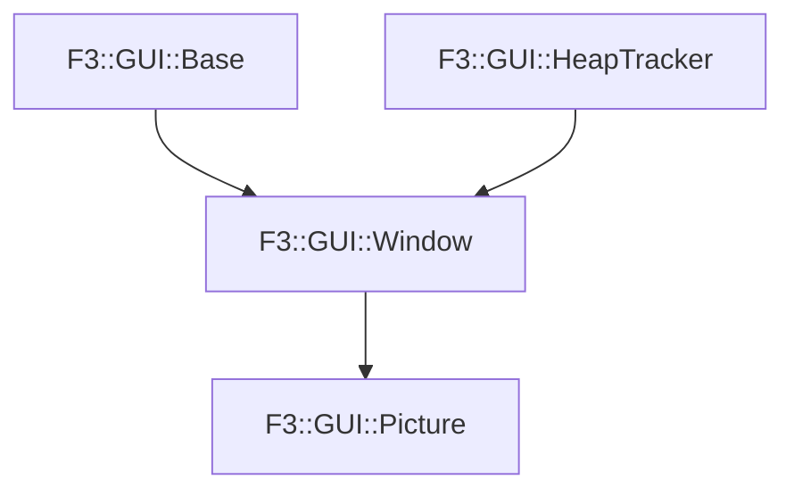

# F3::GUI::Picture

[Return to `F3`](/docs/F3.md)

## C++

- [`Picture.hpp`](/c++/include/Picture.hpp)
- [`Picture.cpp`](/c++/source/Picture.cpp)

## Inheritance

```mermaid
graph TD;
    F3::GUI::Base-->F3::GUI::Window
    F3::GUI::HeapTracker-->F3::GUI::Window
    F3::GUI::Window-->F3::GUI::Picture
```

[Return to `F3`](/docs/F3.md)