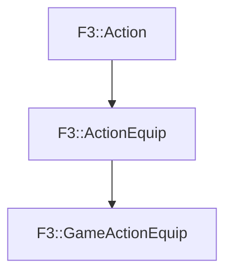

# F3::GameActionEquip

[Return to `F3`](/docs/F3.md)

## C++

- [`GameActionEquip.hpp`](/c++/include/GameActionEquip.hpp)
- [`GameActionEquip.cpp`](/c++/source/GameActionEquip.cpp)

## References

- [`F3::Action`](/docs/F3/Action.md)
- [`F3::ActionEquip`](/docs/F3/ActionEquip.md)

## Inheritance

[Return to `F3`](/docs/F3.md)