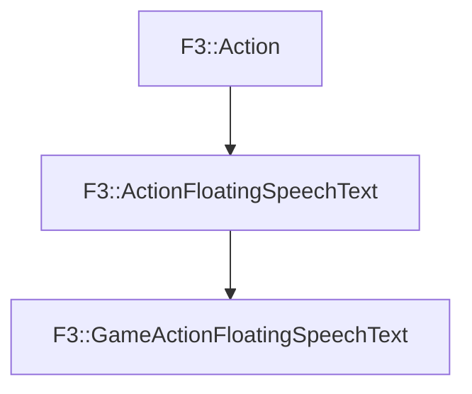

# F3::GameActionFloatingSpeechText

[Return to `F3`](/docs/F3.md)

## C++

- [`GameActionFloatingSpeechText.hpp`](/c++/include/GameActionFloatingSpeechText.hpp)
- [`GameActionFloatingSpeechText.cpp`](/c++/source/GameActionFloatingSpeechText.cpp)

## References

- [`F3::Action`](/docs/F3/Action.md)
- [`F3::ActionFloatingSpeechText`](/docs/F3/ActionFloatingSpeechText.md)

## Inheritance

[Return to `F3`](/docs/F3.md)