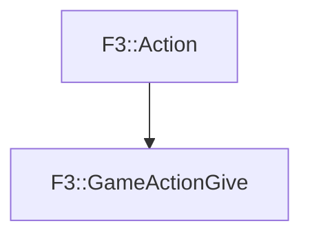

# F3::GameActionGive

[Return to `F3`](/docs/F3.md)

## C++

- [`GameActionGive.hpp`](/c++/include/GameActionGive.hpp)
- [`GameActionGive.cpp`](/c++/source/GameActionGive.cpp)

## References

- [`F3::Action`](/docs/F3/Action.md)

## Inheritance

[Return to `F3`](/docs/F3.md)