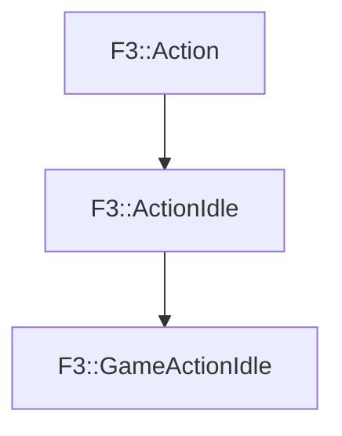

# F3::GameActionIdle

[Return to `F3`](/docs/F3.md)

## C++

- [`GameActionIdle.hpp`](/c++/include/GameActionIdle.hpp)
- [`GameActionIdle.cpp`](/c++/source/GameActionIdle.cpp)

## References

- [`F3::Action`](/docs/F3/Action.md)
- [`F3::ActionIdle`](/docs/F3/ActionIdle.md)

## Inheritance

[Return to `F3`](/docs/F3.md)