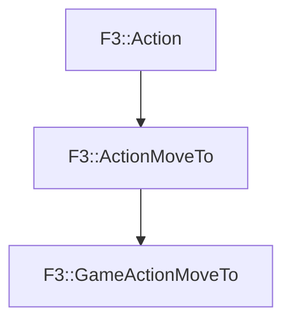

# F3::GameActionMoveTo

[Return to `F3`](/docs/F3.md)

## C++

- [`GameActionMoveTo.hpp`](/c++/include/GameActionMoveTo.hpp)
- [`GameActionMoveTo.cpp`](/c++/source/GameActionMoveTo.cpp)

## References

- [`F3::Action`](/docs/F3/Action.md)
- [`F3::ActionMoveTo`](/docs/F3/ActionMoveTo.md)

## Inheritance

[Return to `F3`](/docs/F3.md)