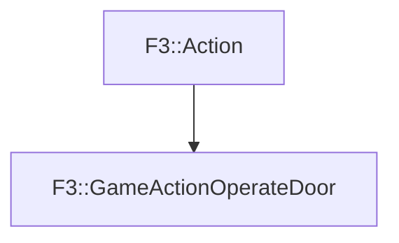

# F3::GameActionOperateDoor

[Return to `F3`](/docs/F3.md)

## C++

- [`GameActionOperateDoor.hpp`](/c++/include/GameActionOperateDoor.hpp)
- [`GameActionOperateDoor.cpp`](/c++/source/GameActionOperateDoor.cpp)

## References

- [`F3::Action`](/docs/F3/Action.md)

## Inheritance

[Return to `F3`](/docs/F3.md)