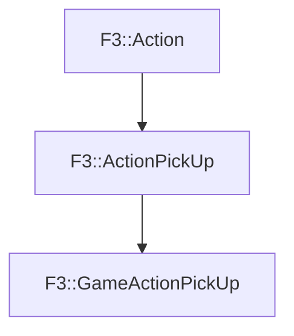

# F3::GameActionPickUp

[Return to `F3`](/docs/F3.md)

## C++

- [`GameActionPickUp.hpp`](/c++/include/GameActionPickUp.hpp)
- [`GameActionPickUp.cpp`](/c++/source/GameActionPickUp.cpp)

## References

- [`F3::Action`](/docs/F3/Action.md)
- [`F3::ActionPickUp`](/docs/F3/ActionPickUp.md)

## Inheritance

[Return to `F3`](/docs/F3.md)