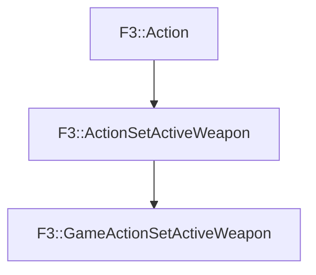

# F3::GameActionSetActiveWeapon

[Return to `F3`](/docs/F3.md)

## C++

- [`GameActionSetActiveWeapon.hpp`](/c++/include/GameActionSetActiveWeapon.hpp)
- [`GameActionSetActiveWeapon.cpp`](/c++/source/GameActionSetActiveWeapon.cpp)

## References

- [`F3::Action`](/docs/F3/Action.md)
- [`F3::ActionSetActiveWeapon`](/docs/F3/ActionSetActiveWeapon.md)

## Inheritance

[Return to `F3`](/docs/F3.md)