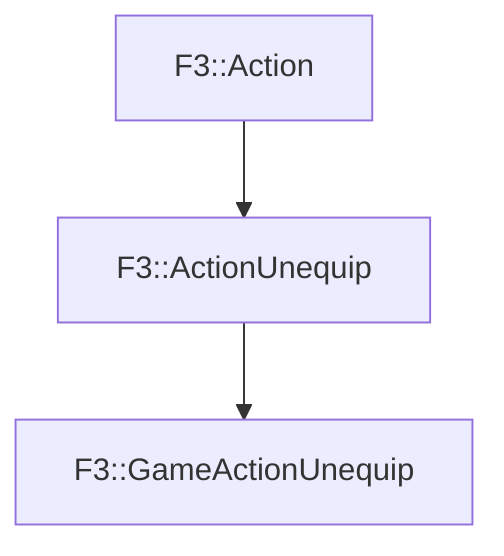

# F3::GameActionUnequip

[Return to `F3`](/docs/F3.md)

## C++

- [`GameActionUnequip.hpp`](/c++/include/GameActionUnequip.hpp)
- [`GameActionUnequip.cpp`](/c++/source/GameActionUnequip.cpp)

## References

- [`F3::Action`](/docs/F3/Action.md)
- [`F3::ActionUnequip`](/docs/F3/ActionUnequip.md)

## Inheritance

[Return to `F3`](/docs/F3.md)