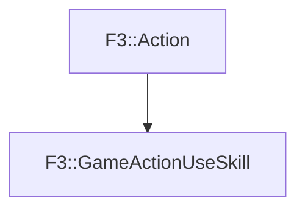

# F3::GameActionUseSkill

[Return to `F3`](/docs/F3.md)

## C++

- [`GameActionUseSkill.hpp`](/c++/include/GameActionUseSkill.hpp)
- [`GameActionUseSkill.cpp`](/c++/source/GameActionUseSkill.cpp)

## References

- [`F3::Action`](/docs/F3/Action.md)

## Inheritance

[Return to `F3`](/docs/F3.md)