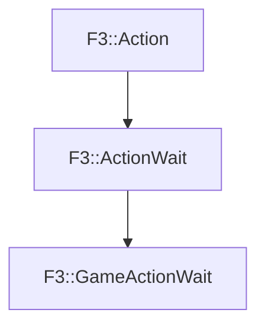

# F3::GameActionWait

[Return to `F3`](/docs/F3.md)

## C++

- [`GameActionWait.hpp`](/c++/include/GameActionWait.hpp)
- [`GameActionWait.cpp`](/c++/source/GameActionWait.cpp)

## References

- [`F3::Action`](/docs/F3/Action.md)
- [`F3::ActionWait`](/docs/F3/ActionWait.md)

## Inheritance

[Return to `F3`](/docs/F3.md)