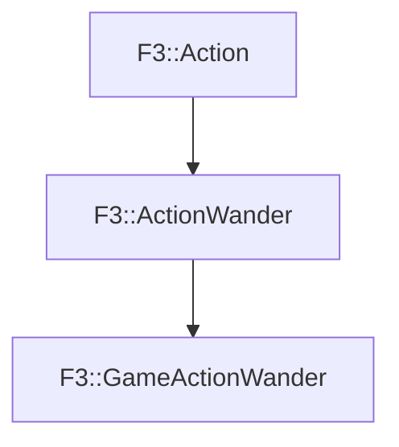

# F3::GameActionWander

[Return to `F3`](/docs/F3.md)

## C++

- [`GameActionWander.hpp`](/c++/include/GameActionWander.hpp)
- [`GameActionWander.cpp`](/c++/source/GameActionWander.cpp)

## References

- [`F3::Action`](/docs/F3/Action.md)
- [`F3::ActionWander`](/docs/F3/ActionWander.md)

## Inheritance

[Return to `F3`](/docs/F3.md)