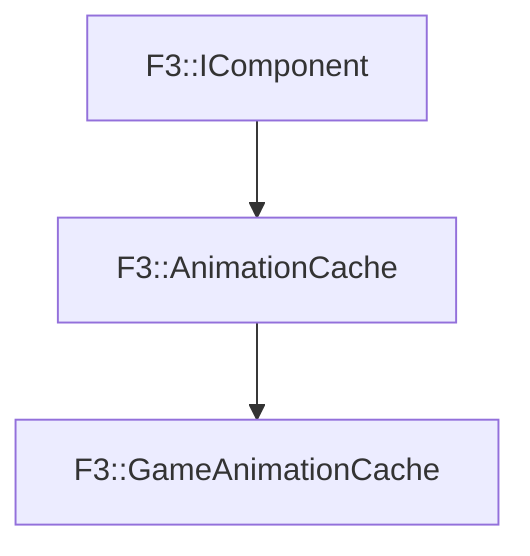

# F3::GameAnimationCache

[Return to `F3`](/docs/F3.md)

## C++

- [`GameAnimationCache.hpp`](/c++/include/GameAnimationCache.hpp)
- [`GameAnimationCache.cpp`](/c++/source/GameAnimationCache.cpp)

## References

- [`F3::IComponent`](/docs/F3/IComponent.md)
- [`F3::AnimationCache`](/docs/F3/AnimationCache.md)

## Inheritance

[Return to `F3`](/docs/F3.md)