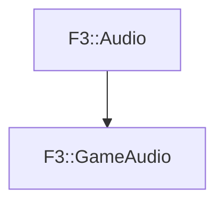

# F3::GameAudio

[Return to `F3`](/docs/F3.md)

## C++

- [`GameAudio.hpp`](/c++/include/GameAudio.hpp)
- [`GameAudio.cpp`](/c++/source/GameAudio.cpp)

## References

- [`F3::Audio`](/docs/F3/Audio.md)

## Inheritance

[Return to `F3`](/docs/F3.md)