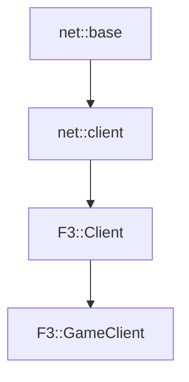

# F3::GameClient

[Return to `F3`](/docs/F3.md)

## C++

- [`GameClient.hpp`](/c++/include/GameClient.hpp)
- [`GameClient.cpp`](/c++/source/GameClient.cpp)

## References

- [`net::base`](/docs/net/base.md)
- [`net::client`](/docs/net/client.md)
- [`F3::Client`](/docs/F3/Client.md)

## Inheritance

[Return to `F3`](/docs/F3.md)