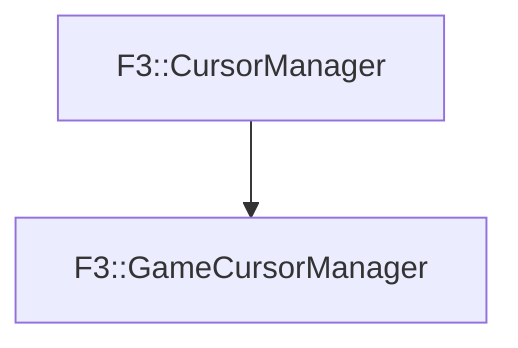

# F3::GameCursorManager

[Return to `F3`](/docs/F3.md)

## C++

- [`GameCursorManager.hpp`](/c++/include/GameCursorManager.hpp)
- [`GameCursorManager.cpp`](/c++/source/GameCursorManager.cpp)

## References

- [`F3::CursorManager`](/docs/F3/CursorManager.md)

## Inheritance

[Return to `F3`](/docs/F3.md)