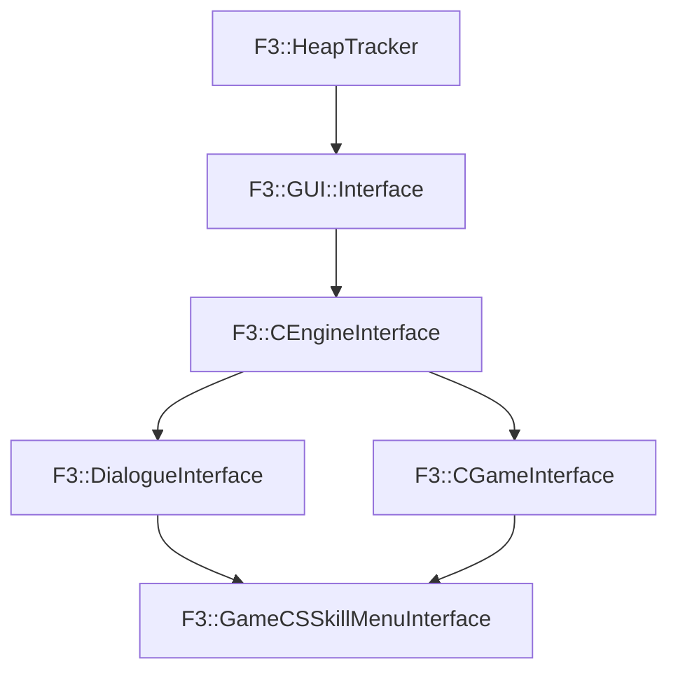

# F3::GameDialogueInterface

[Return to `F3`](/docs/F3.md)

## C++

- [`GameDialogueInterface.hpp`](/c++/include/GameDialogueInterface.hpp)
- [`GameDialogueInterface.cpp`](/c++/source/GameDialogueInterface.cpp)

## References

- [`F3::HeapTracker`](/docs/F3/HeapTracker.md)
- [`F3::GUI::Interface`](/docs/F3/GUI/Interface.md)
- [`F3::CEngineInterface`](/docs/F3/CEngineInterface.md)
- [`F3::DialogueInterface`](/docs/F3/DialogueInterface.md)
- [`F3::CGameInterface`](/docs/F3/CGameInterface.md)

## Inheritance

[Return to `F3`](/docs/F3.md)