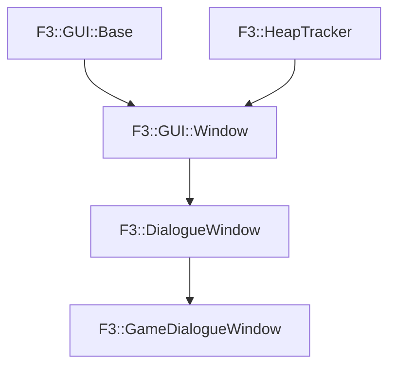

# F3::GameDialogueWindow

[Return to `F3`](/docs/F3.md)

## C++

- [`GameDialogueWindow.hpp`](/c++/include/GameDialogueWindow.hpp)
- [`GameDialogueWindow.cpp`](/c++/source/GameDialogueWindow.cpp)

## References

- [`F3::GUI::Base`](/docs/F3/GUI/Base.md)
- [`F3::HeapTracker`](/docs/F3/HeapTracker.md)
- [`F3::GUI::Window`](/docs/F3/GUI/Window.md)
- [`F3::DialogueWindow`](/docs/F3/DialogueWindow.md)

## Inheritance

[Return to `F3`](/docs/F3.md)