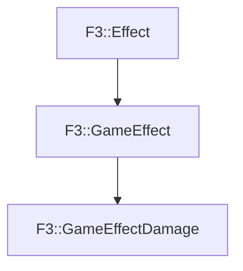

# F3::GameEffectDamage

[Return to `F3`](/docs/F3.md)

## C++

- [`GameEffectDamage.hpp`](/c++/include/GameEffectDamage.hpp)
- [`GameEffectDamage.cpp`](/c++/source/GameEffectDamage.cpp)

## References

- [`F3::Effect`](/docs/F3/Effect.md)
- [`F3::GameEffect`](/docs/F3/GameEffect.md)

## Inheritance

[Return to `F3`](/docs/F3.md)