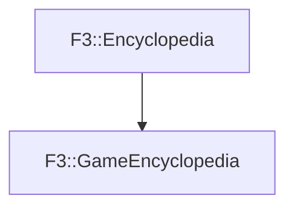

# F3::GameEncyclopedia

[Return to `F3`](/docs/F3.md)

## C++

- [`GameEncyclopedia.hpp`](/c++/include/GameEncyclopedia.hpp)
- [`GameEncyclopedia.cpp`](/c++/source/GameEncyclopedia.cpp)

## References

- [`F3::Encyclopedia`](/docs/F3/Encyclopedia.md)

## Inheritance

[Return to `F3`](/docs/F3.md)