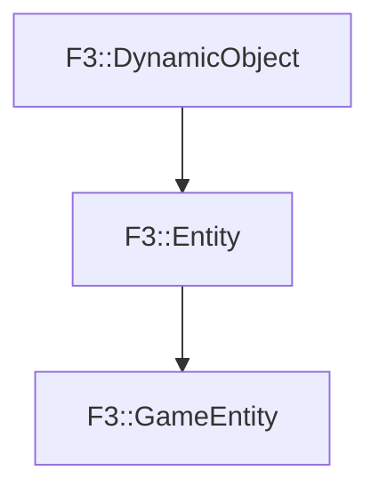

# F3::GameEntity

[Return to `F3`](/docs/F3.md)

## C++

- [`GameEntity.hpp`](/c++/include/GameEntity.hpp)
- [`GameEntity.cpp`](/c++/source/GameEntity.cpp)

## References

- [`F3::DynamicObject`](/docs/F3/DynamicObject.md)
- [`F3::Entity`](/docs/F3/Entity.md)

## Inheritance

[Return to `F3`](/docs/F3.md)