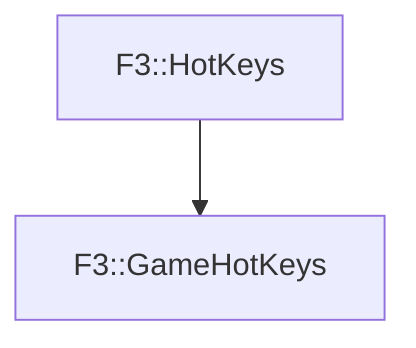

# F3::GameHotKeys

[Return to `F3`](/docs/F3.md)

## C++

- [`GameHotKeys.hpp`](/c++/include/GameHotKeys.hpp)
- [`GameHotKeys.cpp`](/c++/source/GameHotKeys.cpp)

## References

- [`F3::HotKeys`](/docs/F3/HotKeys.md)

## Inheritance

[Return to `F3`](/docs/F3.md)