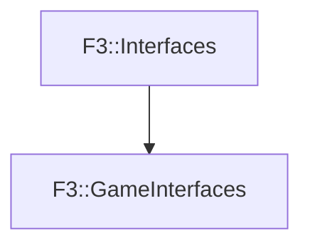

# F3::GameInterfaces

[Return to `F3`](/docs/F3.md)

## C++

- [`GameInterfaces.hpp`](/c++/include/GameInterfaces.hpp)
- [`GameInterfaces.cpp`](/c++/source/GameInterfaces.cpp)

## References

- [`F3::Interfaces`](/docs/F3/Interfaces.md)

## Inheritance

[Return to `F3`](/docs/F3.md)