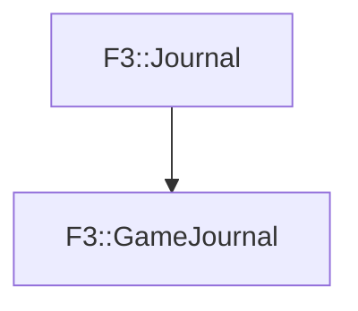

# F3::GameJournal

[Return to `F3`](/docs/F3.md)

## C++

- [`GameJournal.hpp`](/c++/include/GameJournal.hpp)
- [`GameJournal.cpp`](/c++/source/GameJournal.cpp)

## References

- [`F3::Journal`](/docs/F3/Journal.md)

## Inheritance

[Return to `F3`](/docs/F3.md)