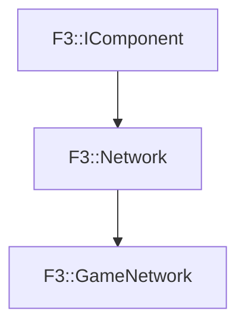

# F3::GameNetwork

[Return to `F3`](/docs/F3.md)

## C++

- [`GameNetwork.hpp`](/c++/include/GameNetwork.hpp)
- [`GameNetwork.cpp`](/c++/source/GameNetwork.cpp)

## References

- [`F3::IComponent`](/docs/F3/IComponent.md)
- [`F3::Network`](/docs/F3/Network.md)

## Inheritance

[Return to `F3`](/docs/F3.md)