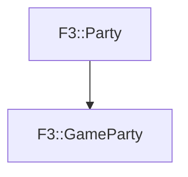

# F3::GameParty

[Return to `F3`](/docs/F3.md)

## C++

- [`GameParty.hpp`](/c++/include/GameParty.hpp)
- [`GameParty.cpp`](/c++/source/GameParty.cpp)

## References

- [`F3::Party`](/docs/F3/Party.md)

## Inheritance

[Return to `F3`](/docs/F3.md)