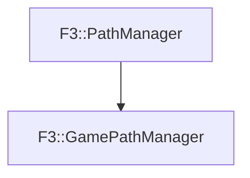

# F3::GamePathManager

[Return to `F3`](/docs/F3.md)

## C++

- [`GamePathManager.hpp`](/c++/include/GamePathManager.hpp)
- [`GamePathManager.cpp`](/c++/source/GamePathManager.cpp)

## References

- [`F3::PathManager`](/docs/F3/PathManager.md)

## Inheritance

[Return to `F3`](/docs/F3.md)