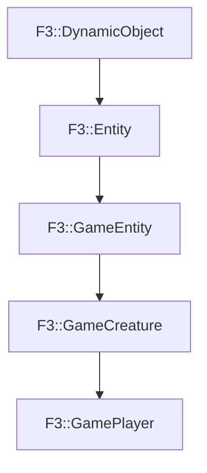

# F3::GamePlayer

[Return to `F3`](/docs/F3.md)

## C++

- [`GamePlayer.hpp`](/c++/include/GamePlayer.hpp)
- [`GamePlayer.cpp`](/c++/source/GamePlayer.cpp)

## References

- [`F3::DynamicObject`](/docs/F3/DynamicObject.md)
- [`F3::Entity`](/docs/F3/Entity.md)
- [`F3::GameEntity`](/docs/F3/GameEntity.md)
- [`F3::GameCreature`](/docs/F3/GameCreature.md)

## Inheritance

[Return to `F3`](/docs/F3.md)