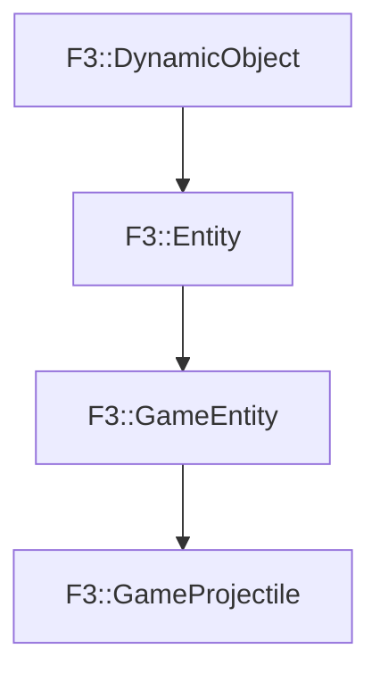

# F3::GameProjectile

[Return to `F3`](/docs/F3.md)

## C++

- [`GameProjectile.hpp`](/c++/include/GameProjectile.hpp)
- [`GameProjectile.cpp`](/c++/source/GameProjectile.cpp)

## References

- [`F3::DynamicObject`](/docs/F3/DynamicObject.md)
- [`F3::Entity`](/docs/F3/Entity.md)
- [`F3::GameEntity`](/docs/F3/GameEntity.md)

## Inheritance

[Return to `F3`](/docs/F3.md)