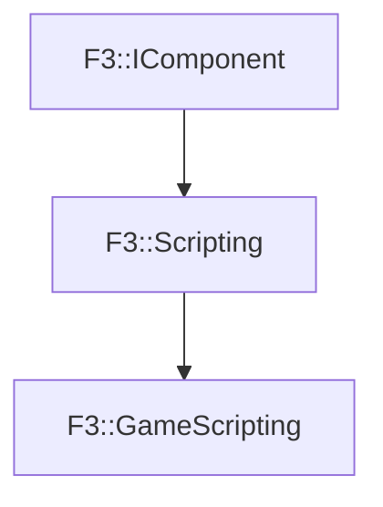

# F3::GameScripting

[Return to `F3`](/docs/F3.md)

## C++

- [`GameScripting.hpp`](/c++/include/GameScripting.hpp)
- [`GameScripting.cpp`](/c++/source/GameScripting.cpp)

## References

- [`F3::IComponent`](/docs/F3/IComponent.md)
- [`F3::Scripting`](/docs/F3/Scripting.md)

## Inheritance

[Return to `F3`](/docs/F3.md)