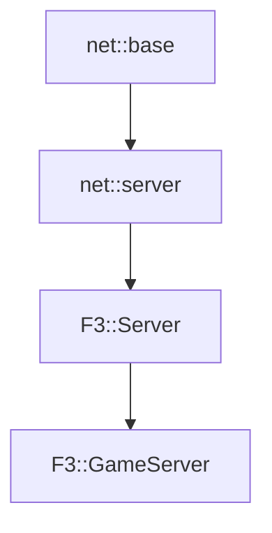

# F3::GameServer

[Return to `F3`](/docs/F3.md)

## C++

- [`GameServer.hpp`](/c++/include/GameServer.hpp)
- [`GameServer.cpp`](/c++/source/GameServer.cpp)

## References

- [`net::base`](/docs/net/base.md)
- [`net::server`](/docs/net/server.md)
- [`F3::Server`](/docs/F3/Server.md)

## Inheritance

[Return to `F3`](/docs/F3.md)