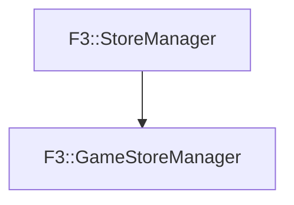

# F3::GameStoreManager

[Return to `F3`](/docs/F3.md)

## C++

- [`GameStoreManager.hpp`](/c++/include/GameStoreManager.hpp)
- [`GameStoreManager.cpp`](/c++/source/GameStoreManager.cpp)

## References

- [`F3::StoreManager`](/docs/F3/StoreManager.md)

## Inheritance

[Return to `F3`](/docs/F3.md)