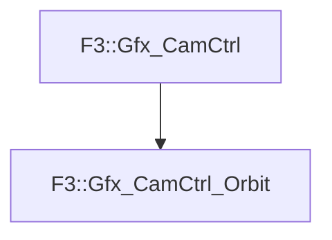

# F3::Gfx_CamCtrl_Orbit

[Return to `F3`](/docs/F3.md)

## C++

- [`Gfx_CamCtrl_Orbit.hpp`](/c++/include/Gfx_CamCtrl_Orbit.hpp)
- [`Gfx_CamCtrl_Orbit.cpp`](/c++/source/Gfx_CamCtrl_Orbit.cpp)

## References

- [`F3::Gfx_CamCtrl`](/docs/F3/Gfx_CamCtrl.md)

## Inheritance

[Return to `F3`](/docs/F3.md)